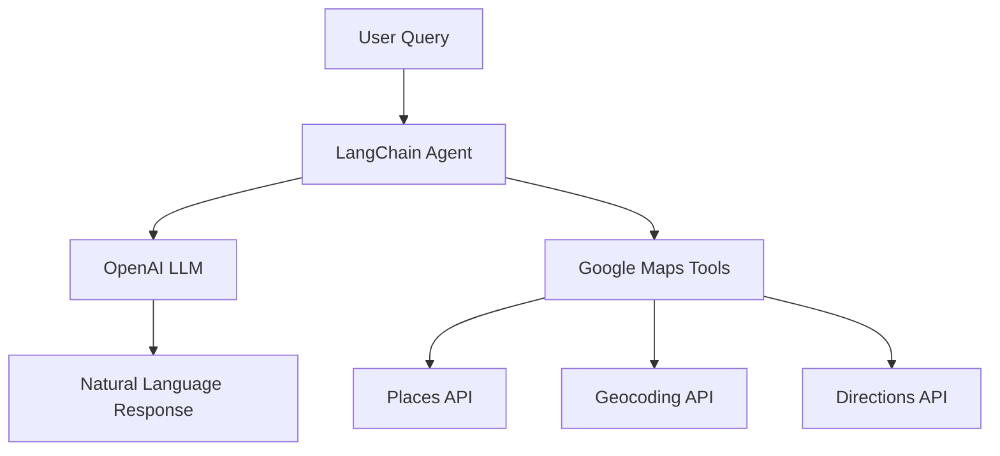

# 🌍 LangChain Google Maps Agent

A natural language interface for Google Maps API using LangChain. Ask questions about locations, directions, and places in plain English.

## 🚀 Features
- **Natural Language Processing**: Query maps using conversational language
- **Multi-API Integration**: 
  - Place details lookup
  - Directions between locations
  - Nearby places search
  - Address geocoding
- **Conversational Memory**: Remains context-aware during chats

## 📦 Repository Structure

google-maps-langchain-agent/
`│`
`├──` .env.example # Template for environment variables
`├──` README.md # This documentation
`├──` requirements.txt # Python dependencies
`├──` main.py # Main application entry point
`│`
`├──` agents/
`│` `├──` init.py # Package initialization
`│` `├──` maps_agent.py # Core agent logic
`│` `└──` tools.py # Google Maps API tools
`│`
`├──` utils/
`│` `├──` init.py
`│` `├──` config.py # Configuration settings
`│` `└──` geocoding.py # Geocoding helpers
`│`
`└──` examples/
`├──` basic_usage.py # Simple usage examples
`└──` advanced_usage.py # Complex implementation samples


## 🛠 Setup Guide

### Prerequisites
- Python 3.8+
- Google Cloud account with billing enabled
- OpenAI API key

### Installation
1. Clone repository:
   ```bash
   git clone https://github.com/your-username/google-maps-langchain-agent.git
   cd google-maps-langchain-agent

🧠 Architecture

